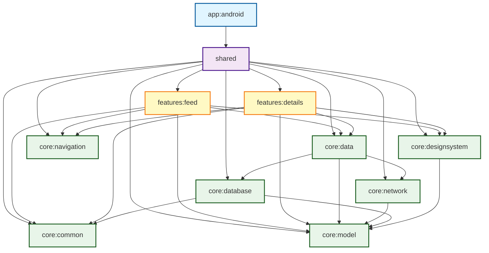

# Stdout

A Kotlin Multiplatform application for reading Hacker News stories and comments.

## Module Graph

## Module Overview

### App Layer
- **app:android** - Android application entry point

### Shared Layer
- **shared** - Shared Kotlin Multiplatform module that aggregates all features and core modules

### Feature Layer
- **features:feed** - Feed screen displaying Hacker News stories with paging support
- **features:details** - Details screen for viewing story details and comments

### Core Layer
- **core:data** - Data repository layer with offline-first support using Store5
- **core:network** - Network layer using Ktor for API communication
- **core:database** - Local persistence using Room database
- **core:designsystem** - Compose UI design system and reusable components
- **core:navigation** - Navigation utilities using Circuit
- **core:common** - Common utilities and dependency injection setup
- **core:model** - Data models shared across modules

## Architecture

This project follows a multi-module architecture pattern:

1. **Separation of Concerns** - Each module has a single, well-defined purpose
2. **Dependency Rule** - Dependencies flow downward (app → shared → features → core)
3. **Kotlin Multiplatform** - Core modules and features are shared between Android and iOS
4. **Compose Multiplatform** - UI is built using Compose Multiplatform for code sharing
