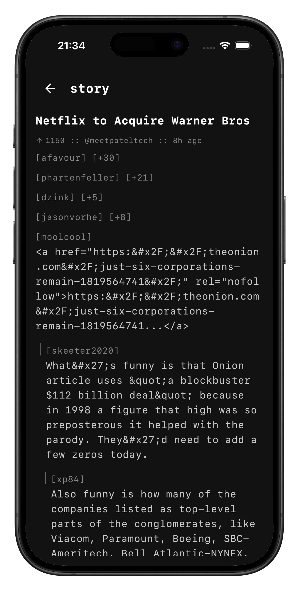
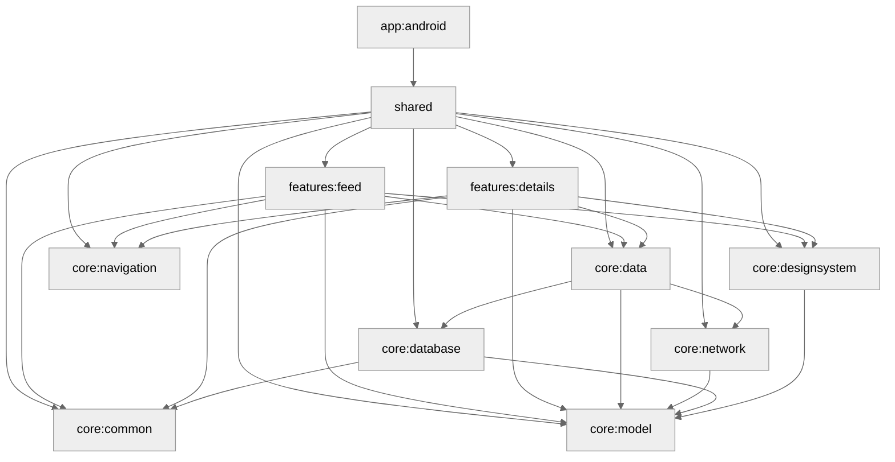

# stdout

A modern Hacker News client with a terminal-inspired interface.

  
  

## Tech Stack

**Kotlin Multiplatform** - Share logic across platforms

**Compose Multiplatform** - UI Framework

**Circuit** - Navigation/Presentation layer

**Store** - Cache management

**Ktor** - Networking

**Room** - Local database

**Kotlin Inject Anvil** - Dependency Injection

**Kotlinx Serialization** - JSON serialization

## Architecture

**Multi-modular**
- `core/*` - Shared business logic, data layer, design system
- `features/*` - Features like feed or detail
- `app/*` - Application entry point to android/ios apps

**Convention Plugins** - Gradle build logic centralized in `build-logic/` to enforce consistency across modules and reduce build file duplication.

**Offline-first** - Store manages network/cache strategies, Room provides local persistence, ensuring the app works seamlessly without connectivity.

Follows unidirectional data flow with Circuit's Presenter pattern, repository pattern for data management, and reactive streams with Kotlin Flow.

## Module Graph

